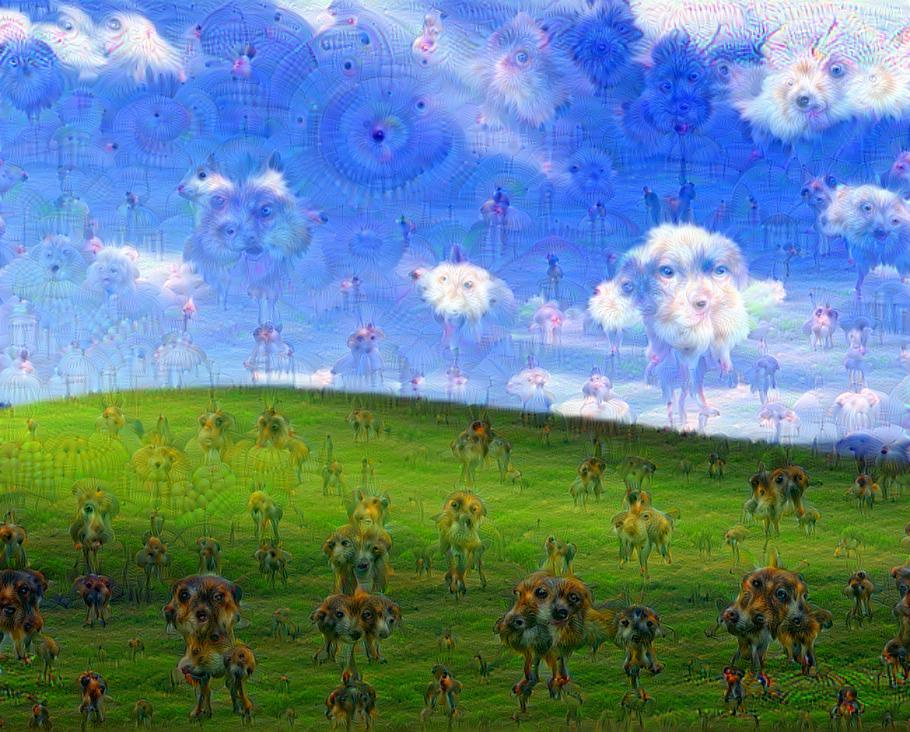
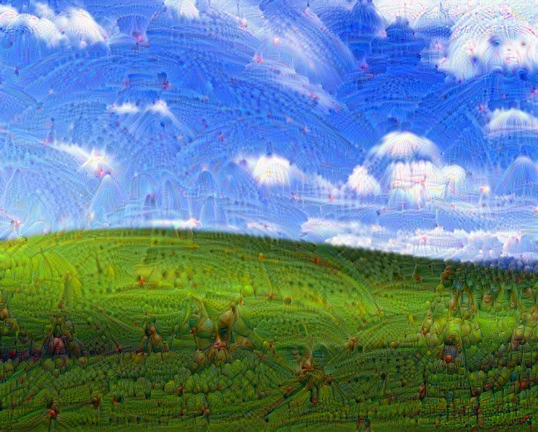

# Example results

All five layer outputs below were generated from the same original image using
separate layers, with the settings recorded in their original JPEG metadata:
30 steps, 4 octaves, step size 1.5, max size 0, tile size 512, JPEG quality 95.
The source photo and the generated image files are examples only; the Apache-2.0
project license does not apply to these photos. The source photograph's rights
were not established during packaging; these files are included in this private
repository at the user's direction. Review the photo's rights before making this
repository public or reusing the images elsewhere.

| Original | `mixed4a` — scales / feathers | `mixed4b` — insects / reptiles |
| --- | --- | --- |
|  |  |  |

| `mixed4c` — dogs / slugs | `mixed4d` — large animals | `mixed4e` — more animals |
| --- | --- | --- |
|  |  |  |

The generated files were produced by the existing batch parameter sweep and kept
at their original image dimensions. EXIF command metadata containing local
filesystem paths was removed for the repository copy.
